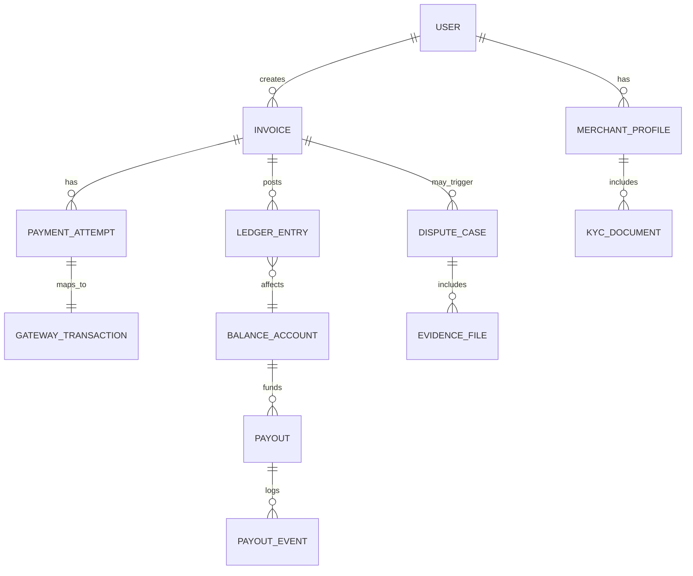
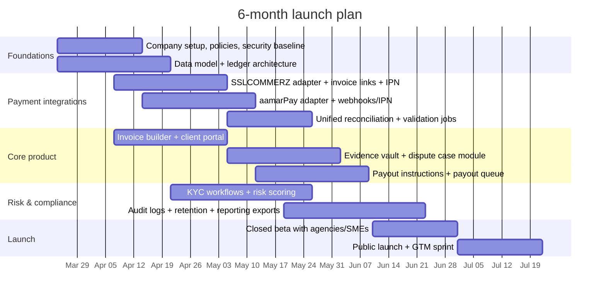

# Business Plan for a Bangladesh-Focused Freelancer Payment Platform

## Executive Summary

Freelancers and small digital businesses serving overseas clients frequently face a predictable bottleneck: foreign clients want to pay with familiar tools (cards, simple online checkout, invoice links), while many Bangladesh-based sellers struggle to offer a compliant, low-friction “pay by link” option without incorporating abroad or relying on complex workarounds. This problem is amplified by the fact that major global payment platforms have limited or no standard merchant availability in Bangladesh (e.g., Bangladesh is not listed in the country lists on PayPal’s official “countries/regions available” page, and Bangladesh is not listed on Stripe’s official “global availability” list). citeturn11view0turn12view0turn11view1turn12view1

This plan proposes a Bangladesh-first “freelancer billing + payments + compliant payout” platform that lets a freelancer generate an invoice/payment link, send it to a foreign client, accept payment (primarily from international cards), and receive local payouts (bank/MFS) while producing the documents and audit trails needed for foreign exchange and tax hygiene. The platform’s payment collection layer will integrate multiple local payment gateways—at minimum SSLCOMMERZ and aamarPay—because both provide “payment link / invoice link” style products and developer APIs suitable for hosted checkout flows. citeturn24search1turn23search1turn20view0turn20view2

A central design assumption is that “easy for the client” must not conflict with regulatory expectations around repatriation of export proceeds, reporting, KYC/AML, and consumer protections. Bangladesh’s foreign exchange rules include long-standing requirements that export proceeds be repatriated within a prescribed period (four months is stated as the default in the consolidated foreign exchange circular hosted on the Bangladesh Trade Portal). citeturn25view0 The platform therefore treats compliance not as an afterthought but as a core product feature: document capture, purpose classification, ledgering/reconciliation, and payout controls.

A practical go-to-market sequence is to start with agencies/SMEs (already able to meet onboarding requirements like trade license/TIN and gateway KYC), then expand to individual freelancers through (a) light-touch onboarding anchored in government freelancer identity initiatives, and/or (b) a regulated “platform/marketplace” model once licensing/partner approvals are secured. citeturn21search8turn23search3turn22view1

## Market, Customers, and Value Proposition

The addressable market is driven by a large and growing pool of Bangladesh-based online workers and service exporters. The Government has launched a national freelancer recognition platform—entity["organization","freelancers.gov.bd","govt freelancer id platform"]—under the entity["organization","ICT Division","govt of bangladesh"] and the entity["organization","Department of ICT","govt of bangladesh"], explicitly to “formally recognize” freelancers and help with access to institutional services such as banking and incentives. citeturn21search8 Separately, an entity["organization","ICT Division","govt of bangladesh"] impact assessment document (Dec 2023) states an estimate of ~650,000 freelancers and frames “payment issues” as a constraint on sector growth. citeturn21search31

**Primary customer segments**

**Freelancers (solo operators).**  
They need fast “invoice → payment → payout” with minimal compliance overhead. Their pain is often: client payment friction, proof-of-remittance for taxes, and unpredictable payout timing. Bangladesh Bank has explicitly addressed freelancer documentation needs by enabling encashment certificates routed through MFS (for ITES export proceeds repatriated via settlement accounts), intended for income tax purposes—underscoring the importance of receipts and traceability. citeturn19view0turn18search5

**Agencies and small digital studios.**  
They have recurring foreign clients, higher ticket sizes, and can usually satisfy onboarding/KYC more easily (trade license, TIN, website). They also benefit from multi-user access controls, structured invoicing, reconciliation exports, and dispute tooling.

**SMEs exporting services (software/ITES, consulting, creative, marketing).**  
They care about enterprise controls: multi-currency display, standardized invoices, accounting integration, and regulatory documentation for export proceeds and potential incentives.

**Core value proposition**

1. **“Send a link, get paid internationally”**: A freelancer can generate a hosted payment link/invoice link that a foreign client can pay via familiar methods (cards), without requiring the client to sign up or use a special app. Both SSLCOMMERZ and aamarPay market “payment links” explicitly as sharable URLs and “accept payment without your website.” citeturn24search1turn23search1turn23search5  
2. **Local payouts with audit trails**: Funds are settled domestically and can be routed to a user’s bank or (where feasible) to mobile wallets via appropriate channels, aligning with Bangladesh Bank foreign exchange circular procedures that allow ADs to credit local accounts and (for certain service income flows) transfer to MFS wallets. citeturn3view0turn25view0  
3. **Compliance-as-product**: Every payment is tied to an invoice, service category, customer identity, and delivery evidence; the platform stores “proof packs” to support bank queries, tax filings, and disputes. This is aligned with Bangladesh Bank circular requirements emphasizing due diligence, reporting, and adherence to AML/CFT. citeturn3view1turn25view0turn19view0  
4. **Multi-gateway resilience**: If one rail blocks a payment (risk flags, card type restrictions, downtime), intelligent routing improves conversion and reduces single-point dependence. SSLCOMMERZ explicitly notes that some transactions are flagged as suspicious—often involving foreign cards—suggesting that risk-routing and fallback flows are commercially important. citeturn23search2turn24search6

## Competitive Landscape and Differentiation

The platform competes against both international tools and local substitutes, but differentiation is strongest where you combine (a) payment-link UX for foreign clients, (b) local settlement/payout rails, and (c) compliance documentation in one workflow.

**International alternatives (and constraints)**

entity["company","PayPal","payments company"] is widely requested by overseas clients, but Bangladesh is not listed on PayPal’s own “countries/regions available” list—one reason it is not a practical default for local merchant acceptance. citeturn11view0turn12view0 entity["company","Stripe","payments company"] similarly does not list Bangladesh among supported countries/regions on its official global availability page. citeturn11view1turn12view1

entity["company","Payoneer","payments platform"] provides a relatively simple “request a payment” model (invoice/payment request sent to a client; client can pay using supported methods). This is a strong alternative for some freelancers, but it is not a Bangladesh-local gateway stack and typically does not solve “local card acquiring + local payment methods + local compliance pack” in one system. citeturn10search13turn10search21

entity["company","Wise","money transfer service"] is a strong cross-border transfer tool in many countries, but Wise states that USD account details are unavailable when the registered address is in Bangladesh. This reduces its usefulness as a “get paid via local USD account details” mechanism for Bangladesh-based freelancers. citeturn10search0

Global labor platforms like entity["company","Upwork","freelance marketplace"] and entity["company","Fiverr","freelance marketplace"] can abstract payments, but they impose platform fees, restrict client relationships, and are not optimized for “bring your own client and invoice.” (Your offering complements them by supporting off-platform work and agency-style recurring clients.) citeturn21search12turn21search31

**Local alternatives**

Local payment gateways and wallet rails already exist, but most are designed for merchants selling to domestic customers or full e-commerce checkout, not for freelancers selling services to foreign clients with “invoice-first” compliance tooling. Your differentiation emerges by productizing: (1) invoice and service documentation, (2) foreign-client payment link UX, (3) risk-aware routing, (4) payout orchestration + reconciliation, and (5) a compliance evidence pack that aligns with Bangladesh Bank circular expectations for service export receipts and documentation. citeturn3view0turn3view1turn25view0

## Regulatory and Compliance Requirements in Bangladesh

This section frames regulatory needs at a level suitable for engineering design. It is not legal advice; you should validate assumptions with counsel and with partner banks/gateways before launch.

### Foreign exchange and service export proceeds

Bangladesh Bank’s foreign exchange circulars establish an explicit framework for repatriating small-value service export receipts through Online Payment Gateway Service Providers (OPGSPs), including controls on notional accounts, transaction value caps, and bank reporting.

A key foundational circular (FE Circular No. 44, Dec 28, 2017) states:  
- ADs must have standing arrangements with internationally recognized OPGSPs and maintain separate nostro collection accounts; service exporters may open notional accounts only with OPGSPs that have arrangements with ADs; funds may not be retained in those notional accounts and must be swept into the nostro collection account. citeturn3view1  
- The facility applies only to non-physical service exports and is capped at USD 5,000 per transaction; beyond the limit, normal banking channels are required. citeturn3view1  
- Chargebacks are a permitted debit to the nostro collection account where the exporter fails to deliver obligations. citeturn3view1  

A subsequent broadening circular (FE Circular No. 33, Oct 18, 2021) expands scope by allowing ADs to facilitate repatriation of service income deposited in their nostro accounts by international marketplaces/platforms and “eligible foreign payment operators,” even without the prior “separate nostro collection account per OPGSP” structure; it emphasizes AD due diligence, customer declarations/undertakings, and repatriation within the statutory period. citeturn3view0 It also specifies that on receipt of inward remittances for service income, ADs credit equivalent local currency to bank accounts or arrange transfers to MFS digital wallets licensed by Bangladesh Bank, with tax compliance required. citeturn3view0

For engineering, the implication is that your platform must be able to:  
- Tag each invoice/payment with a “service export” classification and retain customer declarations and service descriptions (matching the circular’s emphasis on nature-of-service declaration and supporting documents). citeturn3view0  
- Enforce per-transaction guardrails (notably USD 5,000 for OPGSP-style flows) and route higher values to bank transfer-based settlement paths as needed. citeturn3view1  
- Support chargeback/dispute evidence retention to defend legitimate services or manage reversals. citeturn3view1

### Repatriation timeline, reporting, and admissible receipt channels

The Bangladesh Trade Portal-hosted consolidated foreign exchange circular indicates the prescribed period for repatriating export proceeds is four months (default), with enforcement under the Foreign Exchange Regulation Act (FERA). citeturn25view0 It also lists permissible payment receipt methods that include receiving payments for exported goods and services through an Authorized Dealer, and explicitly references proceeds realized “under ‘Acquiring Service’ in the realization of proceeds against export through the internet,” and from OPGSPs/other legitimate operators. citeturn25view0

This matters because your business model relies heavily on “acquiring + card rails” via domestic payment gateways. Practically, you should treat every successful payment as a recorded export receipt and maintain a reconciliation-chain from invoice → gateway transaction → settlement → payout, so that banks and auditors can map funds to services and timelines. citeturn25view0

### Proof-of-remittance and freelancer tax documentation

Bangladesh Bank has issued specific guidance to support income tax documentation for freelancer-related inward remittances via MFS. FE Circular No. 31 (Nov 16, 2022) allows ADs maintaining settlement accounts to issue electronic encashment certificates (with QR code) against inward remittances on account of ITES exports, accessible to beneficiaries through MFS providers, and states the certificate is intended for income tax purpose only. citeturn19view0

For your platform, the design takeaway is to produce “downloadable evidence packs” and—where possible—integrate with bank/MFS processes that generate encashment certificates (or store the certificate reference). Even if your initial card-acquiring model doesn’t always flow through MFS settlement accounts, the user expectation for “tax proof” is now formalized in the ecosystem. citeturn19view0turn18search5

### Payment system licensing, trust accounts, and draft PSO rules

Bangladesh’s Payment and Settlement System Act 2024 introduces a stronger statutory framework around payment system participation and licensing; reporting around the law highlights that “no banking company” can participate in or operate a payment system or provide electronic currency payment services without Bangladesh Bank approval. citeturn26search8turn6search0turn26search4

For your particular platform, the practical decision is whether you operate as:  
- A software layer that helps merchants/freelancers use licensed gateways under their own merchant accounts (lower licensing burden for you, heavier onboarding for users), or  
- A platform/marketplace that effectively collects money from payers and pays out to many freelancers (this tends to look like “payment facilitation/aggregation,” increasing the likelihood of licensing requirements or operating strictly under a licensed partner).  

Draft PSO Regulation 2025 (published for public feedback in Nov 2025) indicates a tightening posture: PSOs must maintain sufficient balance in a Trust and Settlement Account (TSA) at the close of each business day to cover outstanding merchant liabilities, with penalties for shortfalls referenced around Tk 30 lakh (or the Standing Lending Facility rate comparator). citeturn26search5turn26search1turn9search22 The same draft reporting also includes operational incident and data breach reporting windows (e.g., 24 hours for major incidents, 72 hours for data breaches). citeturn26search1 A later news report (Jan 2026) notes Bangladesh Bank instructing digital financial services institutions to submit detailed trust/settlement and liability data, compiled monthly, based on daily data. citeturn26search2turn26search6

Engineering implications: Build your ledgering, reserve/risk policies, and reporting exports as if you will eventually be audited under a trust/settlement-account regime—because regulatory direction is toward tighter liability coverage and higher reporting cadence. citeturn26search5turn26search2

### KYC/AML, e-KYC, and recordkeeping

Bangladesh’s AML ecosystem includes the Money Laundering Prevention Act framework and related guidance. The official “Guidelines on Electronic Know Your Customer (e-KYC)” (Jan 2020) indicates that it applies to banks and entities licensed by Bangladesh Bank and is issued under statutory powers; it anticipates risk-based e-KYC norms (simplified/regular based on thresholds and risk). citeturn26search11turn9search12

For your platform, a realistic approach is:  
- **User-side KYC:** Verify the freelancer/merchant identity (NID, TIN, trade license if applicable), optionally using government-issued Freelancer ID as a trust signal. citeturn21search8turn23search3  
- **Payer-side risk controls:** Capture payer details needed for fraud and chargeback defense while minimizing friction (name, email, billing address, service description).  
- **AML controls and record retention:** Implement transaction monitoring and store structured data long-term; draft PSO coverage suggests multi-year preservation requirements (e.g., 12 years mentioned in one draft reporting summary). citeturn26search1

## Partner Strategy and Rail Options

### Minimum gateway stack and why it works

The platform’s initial “collection” layer should use at least two gateways to maximize acceptance and resilience.

The first two gateways—entity["company","SSLCOMMERZ","payment gateway bd"] and entity["company","aamarPay","payment gateway bd"]—are priority because both offer:  
- **Payment links / invoice links** as explicit products (shareable URL, pay without website), and  
- **Developer APIs** enabling hosted checkout, sandbox testing, and IPN/webhook-style payment notifications. citeturn24search1turn23search1turn20view0turn20view2turn20view1

They also explicitly position themselves as supporting international payment acceptance via cards: aamarPay states it accepts both local and international “valid bank approved cards” and lists major rails; SSLCOMMERZ markets multi-currency payment links and flags that foreign-card transactions are often the suspicious ones—evidence that foreign card acceptance is in-scope operationally. citeturn24search3turn24search1turn23search2

Beyond the minimum, you should design for plug-in expansion to:  
- entity["company","PortWallet","payment gateway bd"] / PortPos (developer-friendly REST APIs) citeturn15search1turn15search34turn15search18  
- entity["company","shurjoPay","payment gateway bd"] (public repo references API documentation and plugins) citeturn15search0  
- Direct wallet rails for domestic payout or collection: entity["company","bKash","mfs bd"] and entity["company","Nagad","mfs bd"] where business APIs/merchant arrangements are available. citeturn15search6turn15search2  

image_group{"layout":"carousel","aspect_ratio":"16:9","query":["SSLCOMMERZ payment links dashboard screenshot","aamarPay payment link screenshot","Bangladesh freelancer invoice payment link","Payoneer payment request screenshot"],"num_per_query":1}

### Gateway comparison table

The table below is designed for product decisions (not contract negotiation). Exact commercial terms vary by merchant category, risk profile, and negotiated rates.

| Provider | Payment-link / invoice-link capability | International card acceptance signals | API/Webhook maturity | Public pricing signals | Onboarding/KYC cues | Marketplace/sub-merchant support |
|---|---|---|---|---|---|---|
| SSLCOMMERZ | Payment Links product; “Accept Multi-currency payments.” citeturn24search1 | Fraud system flags suspicious transactions “most of which are made by foreign cards” (implies foreign card flow exists). citeturn23search2 | Dev docs describe hosted checkout + IPN + validation API; invoice API endpoints for payment link/QR. citeturn20view1turn20view0turn24search6 | Setup fee ৳25,500 (non-refundable) and 2.5% per successful transaction (3.5% AMEX) shown on pricing page. citeturn22view0turn24search0 | Merchant onboarding is online; “minimum required documentation” marketed. citeturn24search5 | Not clearly documented publicly; treat as “requires partner agreement.” |
| aamarPay | Payment Links marketed as “accept payment…without your website.” citeturn23search1turn23search5 | States it accepts local + international bank-approved cards; and lists major methods. citeturn24search3turn24search9 | API reference includes JSON/form endpoints and IPN/webhook documentation. citeturn20view2turn20view3 | Registration invoice shows sample per-transaction fees (e.g., 3.25% card; 2.1% wallets) and one-time fee in an example package; “no monthly/hidden charges” claim in FAQ. citeturn22view1turn13search1 | Explicit document list: trade license, TIN, VAT (if any), NID, incorporation docs, etc. citeturn23search3turn22view1 | Not clearly documented publicly; treat as “requires partner agreement.” |
| PortWallet/PortPos | API supports invoices (SDK mentions “create an invoice”). citeturn15search18 | International support not clearly stated in official text captured here | REST API documentation is public. citeturn15search1 | Fees not captured from official sources here | Not assessed here | Not assessed here |
| shurjoPay | Plugins and API docs referenced publicly by the operator’s repos. citeturn15search0 | International card support not confirmed from primary docs here | Documentation exists (via linked docs) citeturn15search0 | Fees not captured from official sources here | Not assessed here | Not assessed here |

### Bank and payout partners

**Authorized Dealer (AD) banks** are not optional in a serious version of this business because foreign exchange reporting and settlement chains flow through the regulated banking system (“payment for goods and services exported… may be received through an AD,” and export proceeds repatriation is enforced by policy). citeturn25view0 The platform should therefore build a bank partner strategy early: settlement accounts, reconciliation formats, how chargebacks are handled, and what documentation banks want for “service export” classification.

For **payouts**, prioritize:  
- Bank transfers to the user’s account (lowest regulatory ambiguity).  
- MFS payouts where feasible; Bangladesh Bank’s FE Circular 33 (2021) explicitly allows ADs to transfer service income receipts to digital wallets maintained with MFS providers licensed by Bangladesh Bank (in that context). citeturn3view0  
- Over time, explore PSP/PSO partner rails that can provide tight payout SLAs without violating trust/liability requirements suggested by draft PSO rules. citeturn26search5turn26search2

## Product Architecture and Integration Plan

### Product concept: “Freelancer billing OS” with multi-gateway payment links

At a high level, the platform is a workflow engine plus a financial ledger:
- **Create invoice** → **Generate payment link** → **Collect payment** → **Reconcile settlement** → **Route payout** → **Maintain compliance evidence**

The platform should be engineered around these non-negotiables:
- Every external payment event maps to an internal immutable ledger entry.
- Every payout is derived from a settled balance minus fees/reserves.
- Every invoice has a compliance folder (service description, delivery evidence, client identity/contact, dispute evidence).

### Reference integration approach for SSLCOMMERZ and aamarPay

**SSLCOMMERZ**  
Two integration paths are explicitly described in the docs: embed “easy checkout” or redirect to hosted page. The documentation also notes the standard triplet: create/get session, IPN, and order validation API; and it highlights risk flags (0 safe, 1 risky). citeturn20view1turn24search2turn24search6  
Invoice API provides specific endpoints for invoice/payment link generation and supports sandbox vs live URLs. citeturn20view0turn20view1

**aamarPay**  
API reference documents initiating payment via JSON POST endpoints (sandbox and live), and provides an IPN/webhook section so you can reliably mark invoices paid even if the user doesn’t return to your site. citeturn20view2

### Sub-merchant model choices

Your product roadmap depends heavily on whether you support “sub-merchants” (freelancers) under a platform master account:

**Bring-your-own-merchant (BYOM) model (recommended for MVP).**  
Each agency/SME connects its own SSLCOMMERZ/aamarPay credentials. Your platform creates payment links through their store ID, and settlement goes directly to their bank account; you provide reconciliation, invoice UX, and compliance evidence packs. This minimizes your role in handling funds and can reduce licensing exposure.

**Platform-as-merchant / marketplace model (recommended for later).**  
The platform receives funds, holds a liability to many freelancers, and pays them out. This is where draft PSO requirements (trust/settlement account coverage of merchant liabilities, reporting cadence) become directly relevant, and you must either be licensed appropriately or operate strictly under a licensed partner’s structure. citeturn26search5turn26search2

### Data model and system design

An event-driven architecture with a strong ledger core is the safest approach because gateways will disagree on timing (authorization vs capture vs settlement), and disputes/refunds introduce negative events.

**Core services/modules (buildable by an AI engineer agent)**  
- Identity/KYC service: user onboarding, document upload, risk tiering (aligned with e-KYC risk-based posture). citeturn26search11  
- Invoicing service: templates, tax/fee breakdown, service category tagging, export-compliance metadata. citeturn3view0turn25view0  
- Payment orchestration service: gateway adapters, smart routing, retry logic, IPN/webhook receiver normalization. citeturn20view1turn20view2  
- Ledger service: double-entry ledger, fee allocation, reserve accounting, reconciliation states.  
- Payout service: payout routing policies (bank, MFS), payout SLAs, instant payout pricing, payout audit logs. citeturn3view0turn26search2  
- Risk & disputes service: risk flags ingestion (e.g., SSLCOMMERZ “risky” indicator), manual review queues, evidence collection, refund workflows. citeturn24search2turn13search0turn13search1  
- Reporting & compliance export: settlement reconciliation reports, export proceeds packages, encashment certificate storage (where applicable), retention policies. citeturn19view0turn25view0turn26search1

### Refunds, disputes, and chargebacks

Both priority gateways explicitly discuss refunds/disputes:

- SSLCOMMERZ FAQ says refunds adjusted within 5–7 working days after initiation; chargeback executed “as per agreement.” citeturn13search0  
- aamarPay states it investigates disputes and refunds if found valid (after checking with relevant parties) and notes chargeback-driven charges per its policy ratio. citeturn13search1turn23search11

Your platform must implement:  
- **Unified dispute case object** (status, reason, deadlines, evidence checklist).  
- **Evidence vault** (contract, delivery proof, communications).  
- **Refund policy engine** (what can be refunded, who bears fees).  
- **Reserve / rolling hold** for higher-risk users to protect the platform in marketplace mode.

## Pricing, Unit Economics, and Financial Model

### Pricing objectives

The platform must balance:
- Competitive freelancer take-home (users must feel “profitable”),
- Partner/gateway costs (MDR, FX spreads, chargeback costs),
- Fraud and operational risk,
- Regulatory compliance overhead (KYC, reporting, audits).

Because gateway transaction fees are meaningful (e.g., SSLCOMMERZ markets 2.5% per successful transaction and a setup fee in its basic plan), your platform’s pricing must avoid stacking too much variable % on top—especially for smaller invoices. citeturn24search0

### Recommended pricing structure

**MVP model (BYOM-first)**  
- **Subscription** (for agencies/SMEs): tiers based on invoice volume and features (multi-user, accounting export, priority support).  
- **Per-invoice platform fee** (small fixed fee) for compliance pack, invoice hosting, client reminders.  
- **Optional add-ons**: branded domain, advanced dispute tooling, automated reconciliation exports.

**Marketplace model (later)**  
- **Take rate**: 0.5%–1.5% (negotiated against lower gateway MDR at scale).  
- **Instant payout fee**: optional (e.g., 0.5% or fixed BDT), explicitly tied to liquidity/settlement constraints and risk reserve.  
- **FX transparency**: display effective conversion rate and any spread when possible, even if applied upstream by acquirers.

### Example unit economics scenarios (illustrative)

Assumptions (illustrative, not guaranteed terms):  
- Gateway MDR average: 2.5% (benchmark aligned with SSLCOMMERZ published starting rate). citeturn24search0  
- Platform variable fee: 0.8% (marketplace mode) or fixed BDT (BYOM mode).  
- Chargeback reserve: 0.2% of GMV for higher-risk cohorts (held temporarily).  
- Payout cost: bank transfer/MFS cost varies; treat as pass-through or bundled for higher tiers.  
- FX spread: often upstream; display and log where feasible.

**Scenario A: $500 invoice**  
- GMV: $500  
- MDR at 2.5%: $12.50  
- Platform fee at 0.8%: $4.00  
- Net to freelancer (before FX): $483.50  
- Platform gross margin (variable): $4.00 less support/ops and any dispute loss exposure

**Scenario B: $2,000 invoice**  
- MDR: $50  
- Platform fee: $16  
- Net to freelancer: $1,934

**Scenario C: $10,000/month agency volume (multiple invoices)**  
- GMV: $10,000  
- MDR: $250  
- Platform fee (0.8%): $80  
- Net to agency: $9,670  
- Platform variable revenue: $80/month + subscription (if any)

These examples illustrate why subscriptions (for heavier users) can be more “profit-friendly” than adding another percent fee on top of MDR.

### Sensitivity table

Illustrative monthly platform variable revenue per $100,000 GMV under different take rates and loss rates.

| Take rate | Gross revenue | Loss/reserve assumed (bps of GMV) | Net contribution before fixed costs |
|---|---:|---:|---:|
| 0.5% | $500 | 20 bps ($200) | $300 |
| 0.8% | $800 | 20 bps ($200) | $600 |
| 1.2% | $1,200 | 30 bps ($300) | $900 |
| 1.5% | $1,500 | 50 bps ($500) | $1,000 |

The platform becomes sustainably profitable only when (a) you scale GMV, (b) you keep loss rates low through risk controls, and (c) you keep customer support costs proportional via automation and tiered support.

## Go-to-Market, Risk Management, and Implementation Plan

### Go-to-market strategy

**Initial wedge: agencies + compliant SMEs**  
They can more easily satisfy gateway onboarding requirements (trade license, TIN, business details). aamarPay’s onboarding materials explicitly list trade license, TIN, NID, and incorporation documents as needed, and its registration workflow requests these uploads. citeturn23search3turn22view1 Targeting these segments first reduces operational friction.

**Positioning**  
- “Send payment links to foreign clients with a professional invoice + compliance pack.”  
- “Multi-gateway routing to reduce failed international payments.”  
- “Audit-friendly reconciliation, ready for accountants and banks.”

**Channel strategy**  
- Partner with freelancer communities and training programs; leverage the government freelancer ID initiative as a trust anchor for user verification and credibility. citeturn21search8turn21search31  
- Partnerships with accounting firms, tax practitioners, and software associations (e.g., entity["organization","BASIS","bangladesh it association"]) to distribute to SMEs and export-oriented service firms. citeturn18search19  
- In-product virality: invoice links include optional “Powered by” branding or referral incentives (ensure this is contract-compliant with gateways).

### Risk analysis and mitigations

**Regulatory risk (highest).**  
Risk: Operating as a de facto payment facilitator/aggregator without appropriate approvals or partner structure. Bangladesh’s draft PSO rules and the broader legal framework trend toward tighter oversight, with explicit trust/settlement-account expectations and reporting duties. citeturn26search5turn26search2turn26search4  
Mitigation: Start BYOM (users bring their own merchant accounts), avoid holding funds in MVP, and develop a licensing/partner roadmap (PSO/PSP or regulated partnership) before shifting into marketplace payouts.

**Fraud + chargeback risk (high).**  
Risk: Foreign card transactions can be flagged; refunds and chargebacks can reverse revenue. SSLCOMMERZ notes foreign cards often trigger suspicious flags. citeturn23search2turn24search6  
Mitigation: Risk scoring by user cohort, transaction limits, milestone-based holds, evidence collection, and a reserve policy. Build an internal queue for “risky” transactions.

**FX and payout timing risk (medium/high).**  
Risk: Users are sensitive to “how much will I get” and “when will I get it.” Policies enforce repatriation timelines; upstream FX rates vary. Export proceeds timelines and repatriation obligations are explicit. citeturn25view0turn3view0  
Mitigation: Show estimated net payout before sending invoice; highlight that settlement timing depends on gateway/bank; offer optional instant payout funded by a liquidity pool with risk-based fees.

**Operational incident and data breach risk (high).**  
Draft PSO reporting summaries include 24-hour incident and 72-hour data breach reporting windows. citeturn26search1  
Mitigation: Security-by-design (least privilege, secrets management, audit logs), incident runbooks, and breach detection tooling from day one.

### MVP feature list and phased roadmap

**MVP (first 8–12 weeks)**
- User onboarding: email/phone, profile, basic KYC document upload (even if not fully verified).  
- Invoice builder: service description, currency display, client details, due date, compliance tags.  
- Payment links (via gateway adapters): create invoice/payment link through SSLCOMMERZ invoice API and aamarPay initiate payment endpoints; embed redirect links under your domain and track clicks. citeturn20view0turn20view2  
- Webhook/IPN receiver: normalize gateway callbacks; mark invoice paid/failed; reconcile with validation endpoints. citeturn20view1turn20view2  
- Basic ledger: invoice status, gross, fees, net, payout status.  
- Payout instructions capture: bank account details; (optionally) mobile wallet details for later payout routing.  
- Evidence vault: upload contract/delivery proof; store for disputes and tax support.  
- Admin console: user risk flags, manual review, refund workflow initiation.

**Phase expansion (months 4–6)**
- Smart routing: gateway selection rules based on currency, country, ticket size, risk scores.  
- Automated reconciliation reports: settlement vs ledger variance reports (export CSV for accounting).  
- Dispute management: case timelines, templated evidence packets, refund workflows aligned with gateway rules. citeturn13search0turn13search1  
- Compliance pack downloads: invoice + payment receipt + client info + service declaration template.

**Phase expansion (months 7–12)**
- Marketplace model pilot (only if regulatory structure is ready): sub-merchant onboarding, reserve policies, payout orchestration, trust/settlement style reporting exports aligned with the direction of PSO oversight. citeturn26search5turn26search2  
- Deeper bank integration: dedicated settlement accounts, automated bank statement ingestion, purpose code reporting support. citeturn25view0  
- Incentive support modules: export incentive checklisting for software/ITES and freelancer categories based on published policy announcements (ensure current circulars are obtained directly from official channels during implementation). citeturn18search14turn18search24

### Six-month launch Gantt

### Resource plan and estimated costs

A realistic “AI-engineer-agent-ready” team plan for the first 6 months:

- Product/Founder (you): requirements, partner contracting, compliance coordination.  
- Tech Lead / Architect: ledger + integration design, security baseline.  
- 2 Full-stack engineers: invoice UX, webhook services, gateway adapters.  
- 1 Backend engineer: ledger + reconciliation + reporting pipelines.  
- 1 QA/Automation: payment flow testing, callback simulations, regression suite.  
- 1 Compliance/Operations lead: KYC ops, dispute operations, documentation templates, bank/gateway coordination.  
- Part-time legal counsel: licensing position, contracts, data retention, consumer terms.

Cost ranges depend heavily on hiring strategy (local vs mixed). Because gateway pricing and regulatory obligations can change, the most important milestone-based budgeting is not just payroll, but: (a) security tooling, (b) audit readiness, (c) dispute ops staffing as volume grows, and (d) partner integration support.

### Milestones to de-risk the business

- **Milestone 1:** End-to-end “invoice → link → paid → reconciled” for both gateways in sandbox and at least one live pilot merchant. citeturn20view0turn20view2  
- **Milestone 2:** Evidence pack + refund/dispute workflow implemented (aligned with gateway stated behaviors). citeturn13search0turn13search1  
- **Milestone 3:** Automated reconciliation that can survive audits and bank queries (ledger immutability + exported reports). citeturn25view0turn26search2  
- **Milestone 4:** Regulatory pathway decision: remain BYOM SaaS or begin licensing/partnering for marketplace payouts (guided by PSO draft direction). citeturn26search5turn26search4